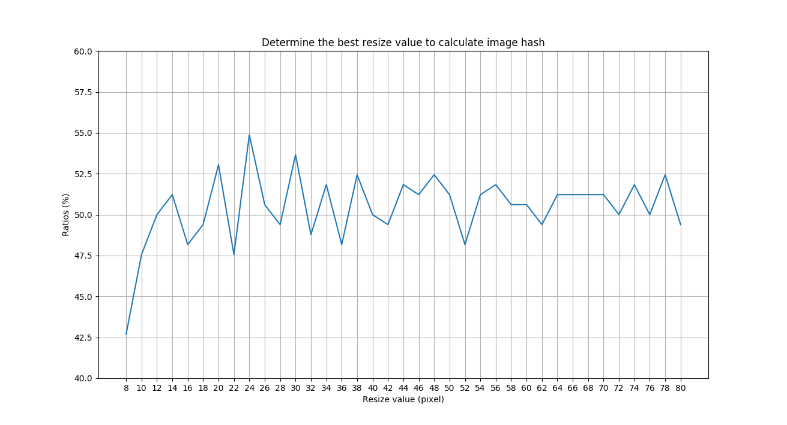

# CaptchaRecognizer

A naive captcha-recognition program
inspired by PHA(perceptual hash algorithm):

The current accuracy is below:

This chart shows that (24,24) is the best parameter to calculate hash value(You may see details in the code). Though the largest accuracy is only 55%...

# Q&A

Obviously neural network performs much better than PHA. 

SO what did I made this for? I made this just for __FUN__~  Furthermore, that's why this readme file is written in English 🙈 

If any other questions, you can refer to [Issues](https://github.com/clouduan/CaptchaRecognizer/issues). 

# More details

Want to see more about PHA? You can refer to these blogposts:

http://www.hackerfactor.com/blog/index.php?/archives/432-Looks-Like-It.html

http://www.hackerfactor.com/blog/index.php?/archives/529-Kind-of-Like-That.html

https://fullstackml.com/wavelet-image-hash-in-python-3504fdd282b5
